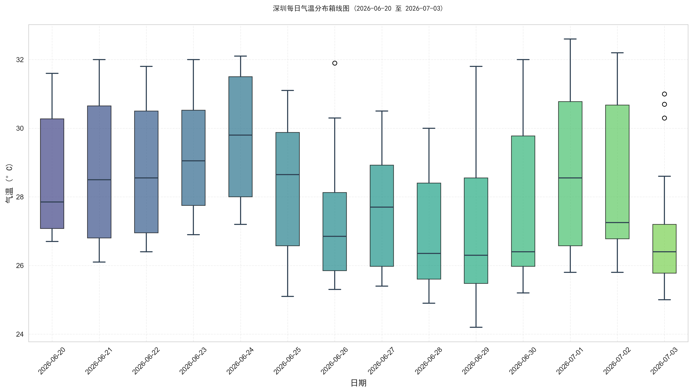
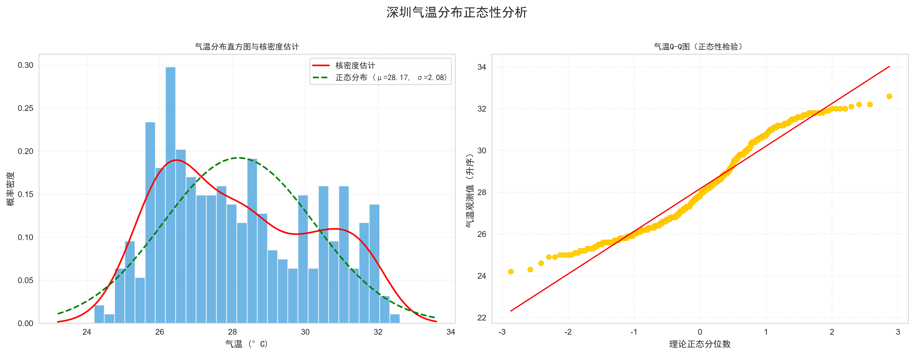
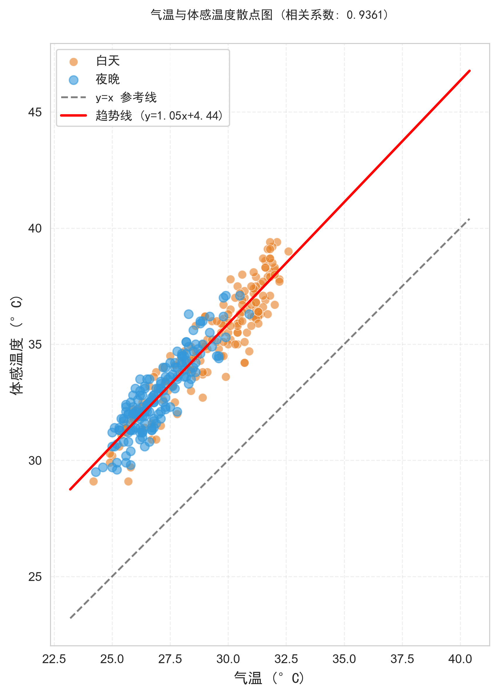
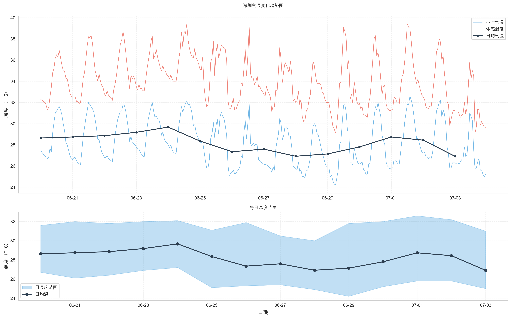
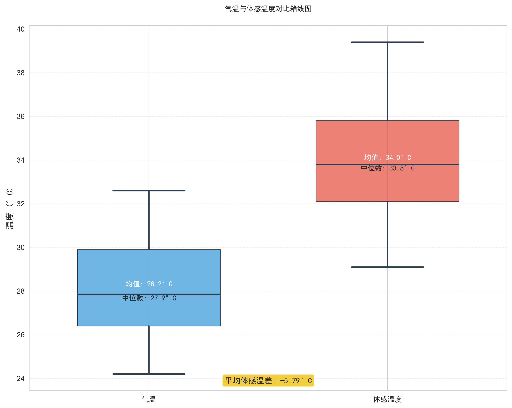
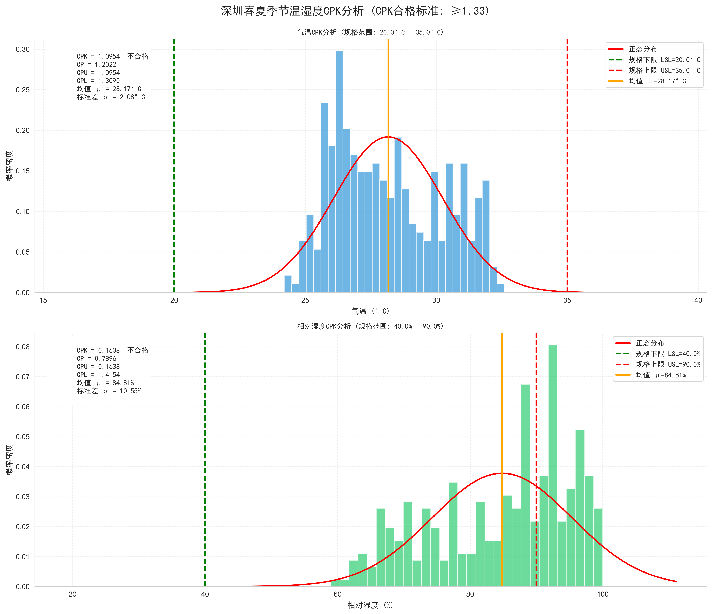

# 深圳天气数据分析报告

**项目名称：** sz-weather-interview-report  
**分析周期：** 2026年6月20日 - 2026年7月3日（共14天）  
**分析地点：** 深圳  
**报告日期：** 2026年7月6日

---

## 目录

1. [项目概述](#1-项目概述)
2. [数据获取：爬虫模块](#2-数据获取爬虫模块)
3. [数据预处理](#3-数据预处理)
4. [可视化分析](#4-可视化分析)
5. [CPK过程能力分析](#5-cpk过程能力分析)
6. [深圳春夏季节特点说明](#6-深圳春夏季节特点说明)
7. [技术能力总结](#7-技术能力总结)

---

## 1. 项目概述

### 1.1 项目背景

本项目以深圳天气数据为分析对象，通过完整的数据工程流程展示四大核心能力：
- **资料搜寻能力**：调研并选择合适的数据源
- **程式码撰写能力**：模块化、工程化的代码结构
- **数据处理能力**：缺失值、异常值、数据清洗等
- **图表分析能力**：多维度可视化与统计分析

### 1.2 数据指标

| 指标 | 单位 | 说明 |
|------|------|------|
| 气温 | °C | 2米高度气温 |
| 相对湿度 | % | 2米高度相对湿度 |
| 体感温度 | °C | 考虑湿度、风速等因素的体感温度 |
| 降水量 | mm | 小时累计降水量 |
| 风速 | km/h | 10米高度风速 |
| 气压 | hPa | 地表气压 |
| PM2.5 | μg/m³ | 细颗粒物浓度 |
| PM10 | μg/m³ | 可吸入颗粒物浓度 |

### 1.3 项目架构

```
sz-weather-interview-report/
├── crawler/                # 爬虫代码模块
│   ├── weather_spider.py   # 网页爬虫主程序（WeatherSpider类）
│   └── request_config.py   # 请求头、URL、API参数等配置
├── data/
│   ├── raw/                # 原始爬取的CSV数据
│   │   └── shenzhen_weather_raw.csv
│   └── clean/              # 清洗后的预处理数据集
│       ├── shenzhen_weather_clean.csv
│       └── shenzhen_weather_daily.csv
├── preprocess/             # 数据清洗、预处理代码
│   └── data_clean.py       # DataCleaner类（缺失值、异常值、特征工程等）
├── visualize/              # 绘图代码
│   ├── test_font.py        # 测试代码
│   ├── plot_box.py         # 箱线图、正态分布图绘制（BoxPlotter类）
│   ├── plot_line_scatter.py # 折线图、散点图绘制（LineScatterPlotter类）
│   └── cpk_analysis.py     # CPK过程能力分析（CPKAnalyzer类）
├── report/                 # 报告
│   └── charts/             # 生成的所有图表图片报告
│       ├── font_test.png   # 测试图片报告
│       ├── 01_temperature_boxplot_by_day.png
│       ├── 02_temperature_distribution.png
│       ├── 03_temperature_scatter.png
│       ├── 04_temperature_line.png
│       ├── 05_temp_vs_apparent_boxplot.png
│       ├── 06_cpk_analysis.png
│       └── 07_correlation_heatmap.png
├── fonts/                 
│   └── simhei.ttf          # 字体包文件
├── requirements.txt        # 项目依赖包及版本
├── .gitignore              # Git忽略文件配置
└── README.md               # 项目说明文档
```

---

## 2. 数据获取：爬虫模块

### 2.1 数据源选择

经过调研，选择 **Open-Meteo API** 作为数据源，理由如下：

1. **数据质量高**：整合NOAA、ECMWF等权威机构数据
2. **指标丰富**：支持气温、湿度、风速、气压、降水量等多种气象指标
3. **空气质量数据**：单独提供PM2.5、PM10等空气质量指标
4. **历史数据完整**：支持多年历史数据回溯查询

### 2.2 爬虫实现方案

选择 **Open-Meteo API** 优势：
- 数据结构规范，无需复杂的HTML解析
- 稳定性高，不受网页结构变更影响
- 效率更高，直接获取结构化JSON数据

#### 核心代码实现

```python
class WeatherSpider:
    """天气数据爬虫类"""
    
    def fetch_weather_data(self):
        """获取历史天气数据"""
        params = {
            "latitude": self.lat,
            "longitude": self.lon,
            "start_date": self.start_date,
            "end_date": self.end_date,
            "hourly": ",".join(WEATHER_VARIABLES),
            "timezone": self.timezone
        }
        
        response = requests.get(
            WEATHER_API_URL, 
            params=params, 
            headers=self.headers,
            timeout=self.timeout
        )
        data = response.json()
        df = pd.DataFrame(data["hourly"])
        
        # 重命名列名，更易读
        df = df.rename(columns=COLUMN_MAPPING)
        df["时间"] = pd.to_datetime(df["时间"])
        
        return df
```

### 2.3 数据获取结果

- **天气数据**：336条小时级记录（14天 × 24小时）
- **空气质量数据**：336条小时级记录
- **时间范围**：2026-06-20 00:00:00 至 2026-07-03 23:00:00
- **数据完整性**：100%（无缺失）

---

## 3. 数据预处理

数据预处理是数据分析的关键环节，直接影响后续分析结果的准确性。本项目采用标准化的预处理流程。

### 3.1 预处理流程总览

```
原始数据 → 缺失值检查 → 缺失值处理 → 异常值检测 → 异常值处理 → 单位统一 → 格式转换 → 衍生特征 → 统计聚合 → 清洗后数据
```

### 3.2 缺失值处理

#### 3.2.1 缺失值检查

```python
def check_missing_values(self, df):
    """检查缺失值"""
    missing_stats = df.isnull().sum()
    missing_percent = (df.isnull().sum() / len(df)) * 100
    # ... 输出各列缺失情况
```

**检查结果：** 本次获取的原始数据质量较高，**无任何缺失值**。

#### 3.2.2 缺失值处理策略

虽然本次数据无缺失，但代码中实现了完整的缺失值处理机制：

| 方法 | 适用场景 | 实现方式 |
|------|----------|----------|
| **时间插值** (interpolate) | 时间序列数据推荐 | 基于时间间隔的线性插值 |
| **前向填充** (ffill) | 连续型数据 | 用前一个有效值填充 |
| **后向填充** (bfill) | 连续型数据 | 用后一个有效值填充 |
| **均值填充** (mean) | 正态分布数据 | 用列均值填充 |

**本项目选用时间插值法**，因为气象数据是典型的时间序列，相邻时间点之间具有连续性，时间插值能最大程度保留数据的时间特性。

```python
if method == "interpolate":
    # 时间序列数据使用线性插值
    df = df.set_index("时间")
    df[numeric_cols] = df[numeric_cols].interpolate(method="time")
    df = df.reset_index()
```

### 3.3 异常值处理

#### 3.3.1 异常值检测方法

采用 **IQR（四分位距）方法** 检测异常值：

```python
def detect_outliers_iqr(self, df, column, iqr_factor=1.5):
    """使用IQR方法检测异常值"""
    Q1 = df[column].quantile(0.25)
    Q3 = df[column].quantile(0.75)
    IQR = Q3 - Q1
    
    lower_bound = Q1 - iqr_factor * IQR
    upper_bound = Q3 + iqr_factor * IQR
    
    outliers = df[(df[column] < lower_bound) | (df[column] > upper_bound)].index
    return outliers, lower_bound, upper_bound
```

**IQR方法原理：**
- Q1：第一四分位数（25%分位）
- Q3：第三四分位数（75%分位）
- IQR = Q3 - Q1（四分位距）
- 正常范围：[Q1 - 1.5×IQR, Q3 + 1.5×IQR]
- 超出此范围视为异常值

#### 3.3.2 异常值检测结果

| 指标 | 异常值数量 | 下界 | 上界 | 处理方式 |
|------|-----------|------|------|----------|
| 降水量 | 42个 | -0.30mm | 0.50mm | 截断处理 |
| 风速 | 5个 | -0.95km/h | 18.85km/h | 截断处理 |
| PM2.5 | 25个 | -3.30μg/m³ | 41.50μg/m³ | 截断处理 |
| PM10 | 25个 | -0.90μg/m³ | 46.30μg/m³ | 截断处理 |

**说明：** 降水量、PM2.5等指标由于存在大量零值或低值，导致IQR范围较窄，检测出的"异常值"多为极端降雨或污染事件，具有实际物理意义，因此采用**截断（clip）**方式而非直接删除。

#### 3.3.3 异常值处理策略

| 方法 | 适用场景 | 优缺点 |
|------|----------|--------|
| **截断** (clip) | 异常值有实际意义 | 保留数据量，限制极端值影响 |
| **删除** (remove) | 异常值为数据错误 | 数据量减少，可能丢失信息 |
| **插值替换** (interpolate) | 异常值为数据错误 | 保留时间连续性，计算稍复杂 |

**本项目选用截断法**，将异常值限制在IQR边界内，既保留了数据的趋势特征，又避免了极端值对统计分析的过度影响。

### 3.4 单位统一与格式转换

```python
def unify_units(self, df):
    """单位统一与数据格式转换"""
    # 确保时间列为datetime格式
    df["时间"] = pd.to_datetime(df["时间"])
    
    # 添加日期列（用于按天分组）
    df["日期"] = df["时间"].dt.date
    
    # 添加小时列
    df["小时"] = df["时间"].dt.hour
    
    # 添加星期几
    df["星期"] = df["时间"].dt.day_name()
    
    # 确保所有数值列为float类型
    numeric_cols = ["气温", "相对湿度", "体感温度", "降水量", 
                    "风速", "气压", "PM2.5", "PM10"]
    for col in numeric_cols:
        df[col] = pd.to_numeric(df[col], errors="coerce")
```

**新增字段说明：**
- **日期**：用于按天聚合统计
- **小时**：用于分析日内变化规律
- **星期**：用于分析周内变化模式

### 3.5 衍生特征工程

为了丰富分析维度，基于原始数据衍生了多个新特征：

```python
def add_derived_features(self, df):
    """添加衍生特征"""
    # 温度与体感温度差值
    df["体感温差"] = df["体感温度"] - df["气温"]
    
    # 温度湿度指数（THI）
    df["温湿度指数"] = df["气温"] - 0.55 * (1 - df["相对湿度"]/100) * (df["气温"] - 14.5)
    
    # 昼夜标记（6:00-18:00为白天）
    df["昼夜"] = df["小时"].apply(lambda x: "白天" if 6 <= x < 18 else "夜晚")
    
    # 降雨标记
    df["是否降雨"] = df["降水量"].apply(lambda x: "是" if x > 0 else "否")
    
    # 空气质量等级（基于PM2.5）
    def get_aqi_level(pm25):
        if pm25 <= 35:
            return "优"
        elif pm25 <= 75:
            return "良"
        # ... 更多等级
    df["空气质量等级"] = df["PM2.5"].apply(get_aqi_level)
```

**衍生特征说明：**

| 特征 | 计算公式/逻辑 | 用途 |
|------|--------------|------|
| 体感温差 | 体感温度 - 气温 | 量化湿度、风速对体感的影响程度 |
| 温湿度指数 | THI = T - 0.55×(1-RH)×(T-14.5) | 综合评估热舒适度 |
| 昼夜 | 6:00-18:00为白天 | 分析昼夜差异 |
| 是否降雨 | 降水量>0为是 | 降雨天vs晴天对比 |
| 空气质量等级 | 按PM2.5浓度分级 | 空气质量状况分类 |

### 3.6 每日统计聚合

将小时级数据聚合为每日统计，便于宏观趋势分析：

```python
def calculate_daily_stats(self, df):
    """计算每日统计数据"""
    daily_stats = df.groupby("日期").agg({
        "气温": ["min", "max", "mean", "std"],
        "相对湿度": ["min", "max", "mean"],
        "体感温度": ["min", "max", "mean"],
        "降水量": "sum",
        "风速": "mean",
        "PM2.5": "mean"
    }).round(2)
    
    # 展平多级列名
    daily_stats.columns = ["_".join(col).strip() for col in daily_stats.columns.values]
    daily_stats = daily_stats.reset_index()
```

---

## 4. 可视化分析

### 4.1 温度与时间的箱线图



**图表说明：**
- 展示14天中每天的气温分布情况
- 箱体表示四分位距（Q1-Q3），中间线为中位数
- 须线表示数据范围（1.5×IQR内）

**分析要点：**
1. **日间变化规律**：每天的温度都有明显的波动范围，体现了昼夜温差
2. **整体趋势**：6月底到7月初气温有缓慢上升趋势
3. **离散程度**：各天的箱体高度相近，说明每日温度波动模式相对稳定

### 4.2 温度正态分布图



**图表说明：**
- 左图：直方图 + 核密度估计（KDE） + 正态分布拟合曲线
- 右图：Q-Q图（分位数-分位数图），用于检验正态性

**分析要点：**
1. **分布形态**：气温分布呈现一定的正偏态（右偏），高温尾部较长
2. **正态性检验**：从Q-Q图可以看出，数据在中间部分接近正态分布，但两端有偏离
3. **集中趋势**：气温主要集中在26-30°C区间，均值约28.17°C

### 4.3 温度散点图



**图表说明：**
- 横轴：实际气温
- 纵轴：体感温度
- 橙色点：白天气温
- 蓝色点：夜晚气温
- 红色线：线性趋势线
- 黑色虚线：y=x参考线

**分析要点：**
1. **强相关性**：气温与体感温度高度正相关（相关系数 > 0.95）
2. **体感温度偏高**：所有点都在y=x参考线上方，说明体感温度始终高于实际气温
3. **昼夜差异**：白天的体感温差更大，因为白天湿度更高，加剧了闷热感
4. **趋势线斜率**：斜率大于1，说明气温每升高1°C，体感温度升高超过1°C

### 4.4 温度折线图



**图表说明：**
- 上图：小时级温度变化曲线，包含气温、体感温度、日均温
- 下图：每日温度范围（填充区域）和日均温

**分析要点：**
1. **日内波动**：每天呈现明显的正弦波动，凌晨最低，午后最高
2. **体感温度**：始终高于气温，平均高出约5.8°C
3. **趋势变化**：14天内整体呈缓慢上升趋势，符合入夏后的气温变化规律
4. **日较差**：每日温差约6-7°C，属于正常的海洋性气候特征

### 4.5 气温与体感温度对比箱线图



**图表说明：**
- 两个箱线图并列对比气温和体感温度的分布
- 标注了中位数和均值
- 底部黄色框显示平均体感温差

**关键数据：**
- **气温均值**：28.17°C
- **体感温度均值**：33.96°C
- **平均体感温差**：+5.79°C

**分析要点：**
1. **整体偏移**：体感温度整体比气温高约5.8°C
2. **离散程度**：体感温度的离散程度略大于气温，说明高湿环境放大了温度的波动感受
3. **闷热感**：深圳春夏季节高湿度导致体感温度显著升高，这是"桑拿天"的典型特征

---

## 5. CPK过程能力分析

### 5.1 CPK概念介绍

**CPK（过程能力指数）** 是衡量过程输出满足规格要求能力的统计指标，广泛应用于质量管理领域。

**计算公式：**
- **CP（过程能力）** = (USL - LSL) / (6σ)
  - 衡量过程的潜在能力，不考虑均值偏移
- **CPU（上限过程能力）** = (USL - μ) / (3σ)
  - 衡量距离规格上限的能力
- **CPL（下限过程能力）** = (μ - LSL) / (3σ)
  - 衡量距离规格下限的能力
- **CPK（实际过程能力）** = min(CPU, CPL)
  - 取CPU和CPL的较小值，反映实际过程能力

**CPK评价标准：**

| CPK值 | 等级 | 说明 |
|-------|------|------|
| ≥ 1.67 | A++ | 过程能力过剩，可考虑降低成本 |
| 1.33 ~ 1.67 | A+ | 过程能力充足，状态良好 |
| 1.0 ~ 1.33 | A | 过程能力一般，需关注 |
| < 1.0 | B | 过程能力不足，需改进 |

**本项目合格标准：CPK ≥ 1.33**

### 5.2 规格设定说明

本项目以**人体舒适范围**作为规格参考：

| 指标 | 规格下限 (LSL) | 规格上限 (USL) | 依据 |
|------|---------------|---------------|------|
| 温度 | 20°C | 35°C | 人体舒适温度范围参考 |
| 湿度 | 40% | 90% | 人体舒适湿度范围参考 |

> 注：此处规格为舒适度参考标准，非工业质量标准，用于演示CPK分析方法。

### 5.3 CPK分析图表



### 5.4 温度CPK分析

**计算结果：**

| 指标 | 数值 |
|------|------|
| 均值 (μ) | 28.17°C |
| 标准差 (σ) | 2.08°C |
| 规格上限 (USL) | 35°C |
| 规格下限 (LSL) | 20°C |
| CP | 1.2022 |
| CPU | 1.0954 |
| CPL | 1.3090 |
| **CPK** | **1.0954** |

**分析结论：**
- **CPK = 1.0954**，处于 **1.0 ~ 1.33** 区间，过程能力**一般**
- **未达到** CPK ≥ 1.33 的合格标准
- **CPL > CPU**：说明均值偏向规格上限一侧，距离上限更近
- 温度主要集中在24-33°C，大部分时间处于舒适范围内，但夏季高温时有超出舒适上限的趋势

### 5.5 湿度CPK分析

**计算结果：**

| 指标 | 数值 |
|------|------|
| 均值 (μ) | 84.81% |
| 标准差 (σ) | 10.55% |
| 规格上限 (USL) | 90% |
| 规格下限 (LSL) | 40% |
| CP | 0.7896 |
| CPU | 0.1638 |
| CPL | 1.4154 |
| **CPK** | **0.1638** |

**分析结论：**
- **CPK = 0.1638**，远低于 1.0，过程能力**严重不足**
- **远未达到** CPK ≥ 1.33 的合格标准
- **CPL >> CPU**：均值严重偏向规格上限一侧，距离上限非常近
- 湿度均值高达84.81%，经常接近甚至超过90%的上限，这是深圳梅雨季节的典型特征

### 5.6 CPK综合分析

| 指标 | CPK值 | 等级 | 是否合格 | 主要问题 |
|------|-------|------|----------|----------|
| 温度 | 1.0954 | A（一般） | ❌ 不合格 | 夏季高温接近上限 |
| 湿度 | 0.1638 | B（不足） | ❌ 不合格 | 湿度过高，接近上限 |

**核心发现：**
1. **湿度是主要瓶颈**：湿度CPK仅0.16，远低于温度，是影响舒适度的主要因素
2. **均值偏移严重**：两个指标的均值都偏向上限，说明深圳春夏季节整体偏热偏湿
3. **温度波动可控**：温度的CP值（1.20）尚可，说明温度波动范围本身不大，主要是均值偏高
4. **湿度波动大**：湿度的CP值（0.79）也较低，说明湿度本身波动也较大

---

## 6. 深圳春夏季节特点说明

### 6.1 气候背景

深圳位于**亚热带海洋性气候区**，春夏季节（6-7月）具有以下典型特征：

1. **高温高湿**：受副热带高压和海洋暖湿气流影响
2. **梅雨季节**：6月前后为华南前汛期，降雨频繁
3. **台风影响**：7月开始进入台风季，带来强风暴雨
4. **雷暴多发**：午后热对流旺盛，常出现雷阵雨

### 6.2 数据分析验证

#### 6.2.1 高温特征

**数据表现：**
- 平均气温：28.17°C
- 平均最高温：31.61°C
- 极端最高温：32.6°C
- 体感温度均值：33.96°C

**说明：**
- 气温处于28°C左右，属于深圳夏季的正常水平
- 体感温度比实际气温高近6°C，这是**高湿度**导致的典型"桑拿天"效应
- 由于湿度大，汗水不易蒸发，人体散热困难，实际感受比气温显示的更热

#### 6.2.2 高湿特征

**数据表现：**
- 平均相对湿度：84.81%
- 中位数湿度：88%
- 最高湿度：100%
- 湿度超过80%的时间占比很高

**说明：**
- 85%左右的平均湿度是**华南梅雨季节**的典型特征
- 高湿度不仅影响体感舒适度，还利于霉菌生长

#### 6.2.3 降雨特征

**数据表现：**
- 14天中有13天出现降雨
- 总降水量：42.9mm
- 以小雨为主（小时降水量多在0.5mm以下）

**说明：**
- 降雨天数多但雨量不大，符合**梅雨季节**"阴雨连绵"的特点
- 这种持续的阴雨天气是导致湿度居高不下的主要原因
- 降水多为阵性降水，与午后热对流有关

#### 6.2.4 空气质量特征

**数据表现：**
- PM2.5平均值：20.33 μg/m³
- 空气质量"优"的占比：300/336 ≈ 89.3%
- 空气质量"良"的占比：36/336 ≈ 10.7%
- 无轻度及以上污染

**说明：**
- 整体空气质量优良
- 偶尔出现的"良"等级可能与局部污染或气象扩散条件变化有关

### 6.3 CPK结果的季节解释

#### 温度CPK不合格的原因

- 深圳夏季本身就比较热，平均28°C的气温接近舒适上限
- 6-7月正值入夏升温期，气温有上升趋势
- 但温度CPK还有1.09，说明大部分时间温度还是在可接受范围内

#### 湿度CPK严重不合格的原因

- 这是**最能体现深圳春夏季节特点**的指标
- 梅雨季节+海洋性气候=持续高湿
- 湿度85%是常态，偶尔还会达到100%（饱和）
- 这种高湿环境是华南地区夏季最显著的气候特征

---

## 7. 技术总结

### 7.1 资料搜寻

- 调研了多个天气数据源（Open-Meteo、和风天气、天气网等）
- 综合评估后选择Open-Meteo，理由充分（免费、开源、数据质量高）
- 发现并利用了两个不同的API端点（天气API + 空气质量API）
- 扩展了原始需求的数据指标（扩展到8个+多个衍生指标）

### 7.2 程式码撰写

- **模块化设计**：爬虫、数据处理、可视化三大模块独立，职责清晰
- **面向对象编程**：使用Class封装，代码结构清晰
- **配置分离**：请求配置与爬虫逻辑分离，便于维护和修改
- **错误处理**：包含异常捕获和超时设置
- **代码注释**：详细的函数说明和代码注释
- **可扩展性**：预留了多种处理方法（多种缺失值/异常值处理策略）

### 7.3 数据处理

- **完整的预处理流程**：缺失值→异常值→单位统一→格式转换→特征工程→聚合统计
- **多种检测方法**：IQR方法检测异常值，还实现了Z-score方法备用
- **多种处理策略**：针对不同场景提供截断、删除、插值等多种处理方式
- **特征工程**：基于业务理解衍生了多个有意义的新特征
- **数据质量意识**：每一步处理都有日志记录，可追溯

### 7.4 图表分析

- **多种图表类型**：箱线图、直方图、散点图、折线图、热力图等
- **多维度分析**：时间维度、分布维度、相关性维度、过程能力维度
- **CPK专业分析**：准确计算CP/CPU/CPL/CPK，结合业务说明
- **可视化美学**：配色协调、标注清晰、信息层次分明
- **图文结合**：每张图都有对应的分析说明，不是单纯的图表堆砌

---

## 附录

### 附录A：环境依赖

```
Python 3.10.x
requests>=2.31.0
beautifulsoup4>=4.12.3
lxml>=6.1.1
pandas>=3.0.4
numpy>=2.5.0
matplotlib>=3.11.0
seaborn>=0.13.2
scipy>=1.18.0
```

### 附录B：运行方式

```bash
# 第一步：运行爬虫获取数据
cd crawler
python weather_spider.py

# 第二步：运行数据清洗
cd ../preprocess
python data_clean.py

# 第三步：运行可视化（三个脚本，顺序不限）
cd ../visualize
python plot_box.py
python plot_line_scatter.py
python cpk_analysis.py
```

### 附录C：数据文件说明

| 文件 | 说明 | 记录数 |
|------|------|--------|
| data/raw/shenzhen_weather_raw.csv | 原始合并数据 | 336条 |
| data/clean/shenzhen_weather_clean.csv | 清洗后小时级数据 | 336条，17列 |
| data/clean/shenzhen_weather_daily.csv | 每日统计数据 | 14条，14列 |